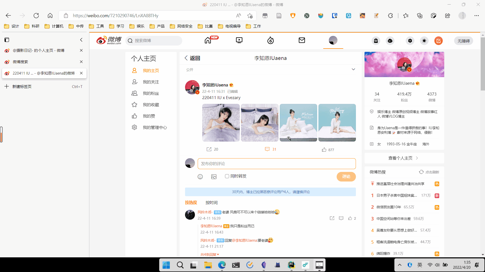

# weiboImage
闲来无事的小工具，年轻人的第一个开源软件

# 技术栈
**爬虫:**  playwright  
**GUI:**  tkinter、 tkinter.ttk(主要用于进度条) 
**多线程:** threading  
**进程通信:** Queue
# 功能
输入单条微博的url,下载里面所有图片的原图

# ing.......
1. 批量获取
2. 类重构
3. 打包成exe
